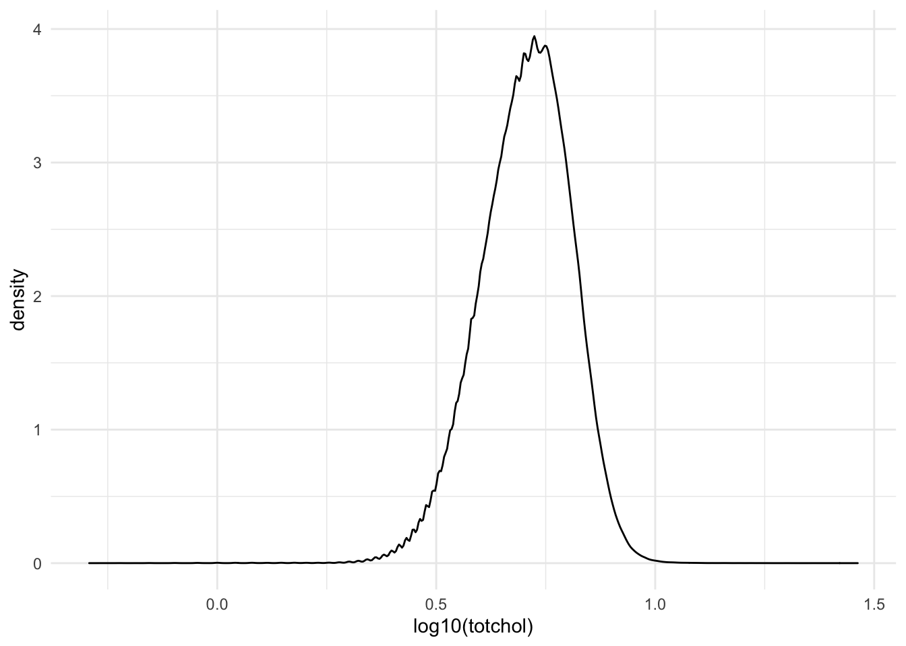
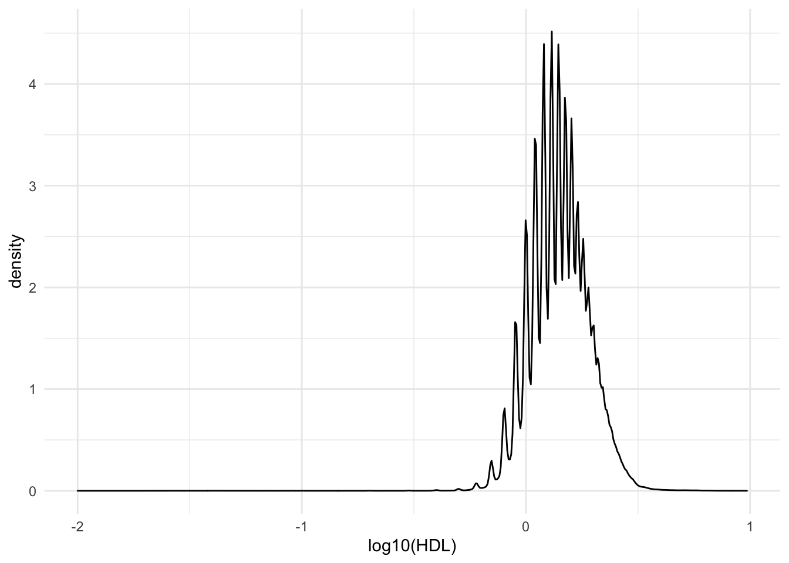
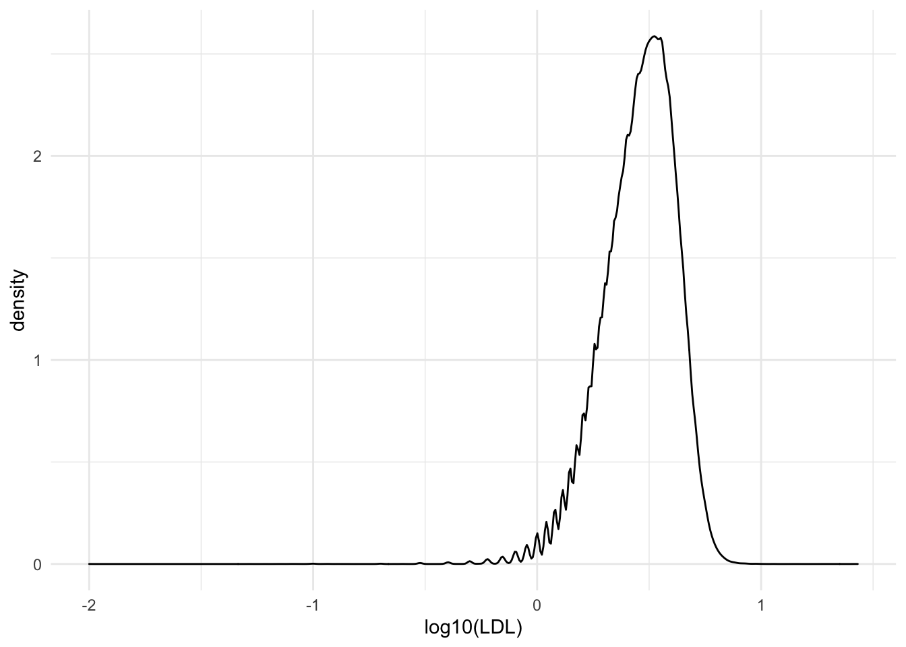
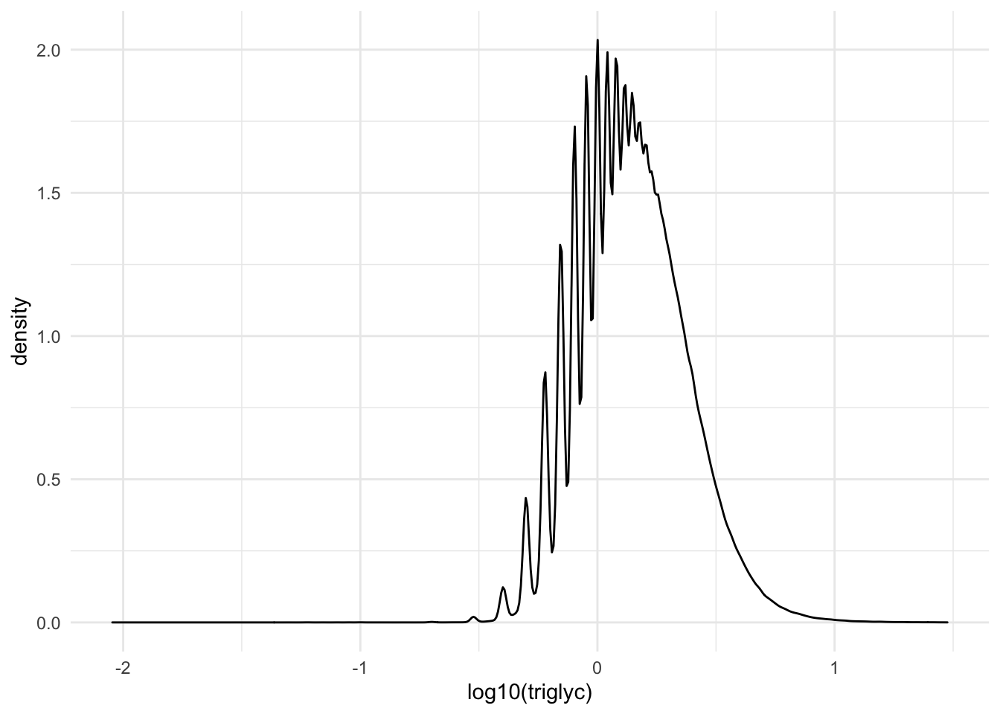
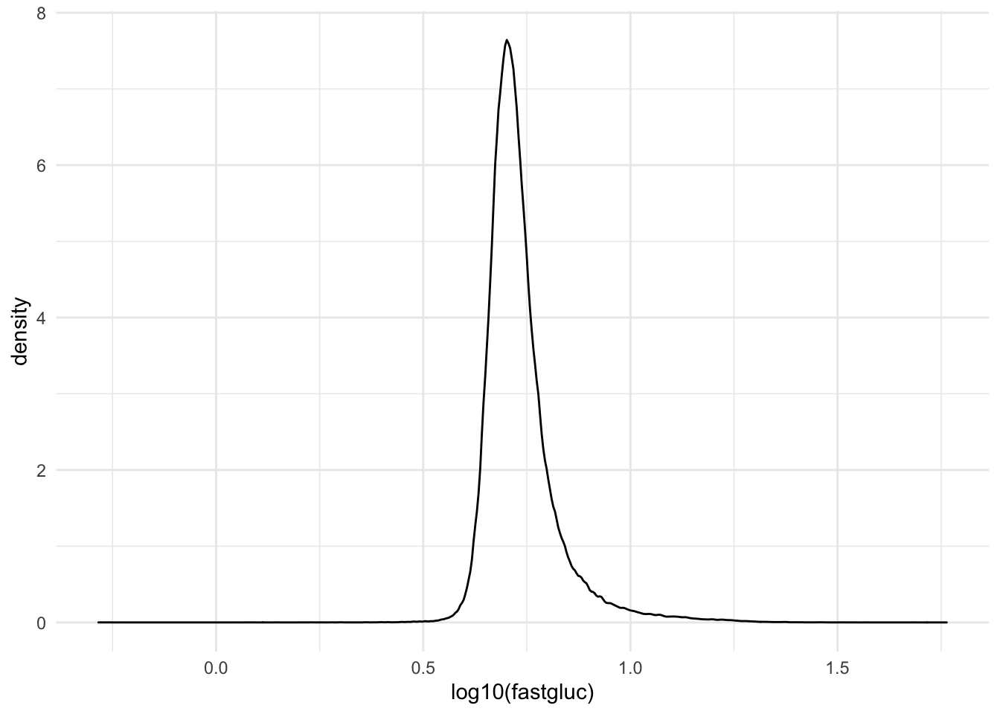
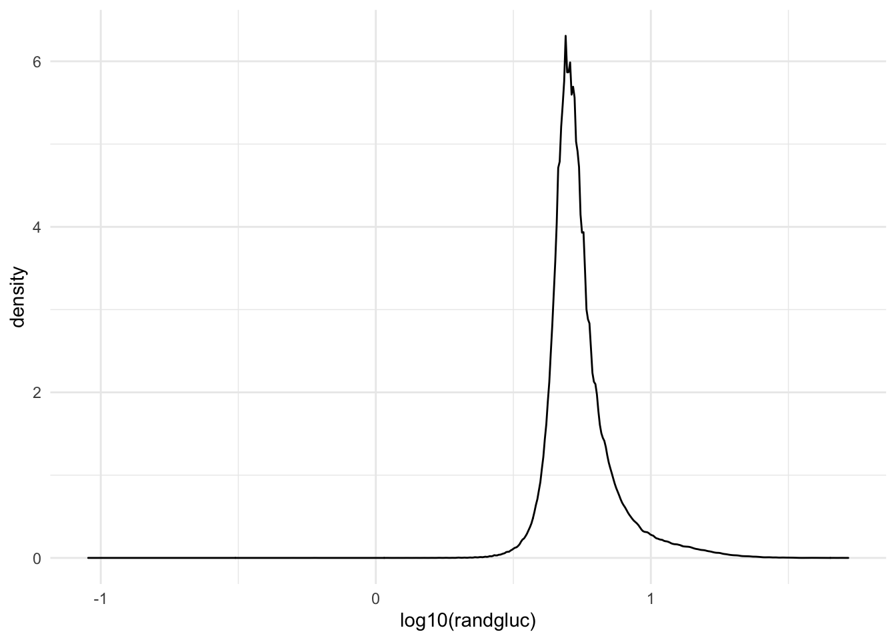
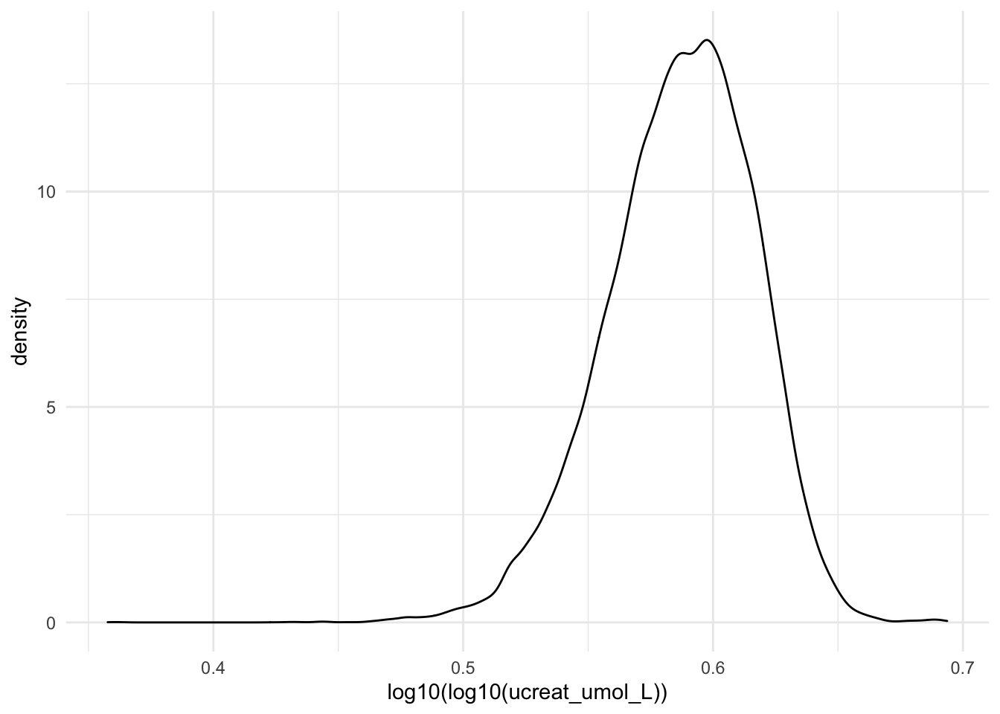
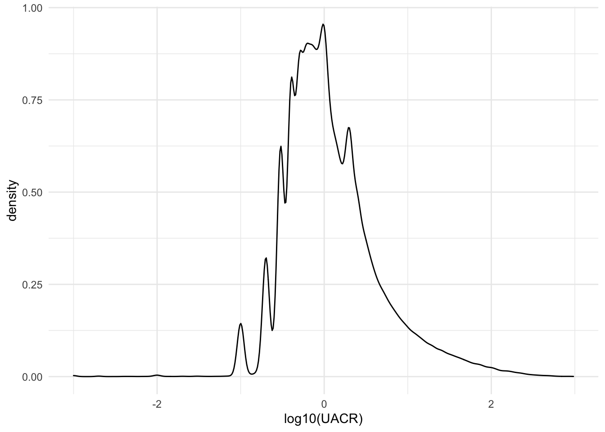
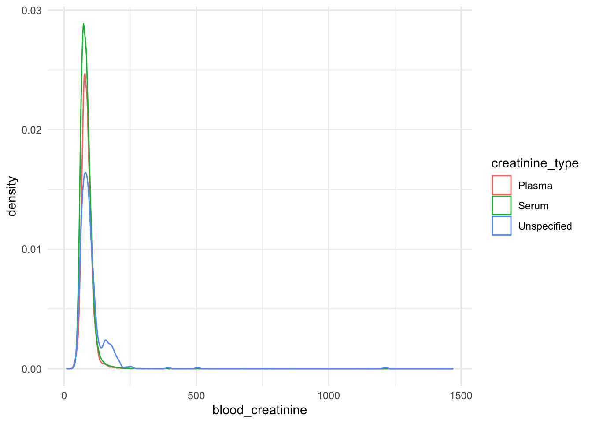
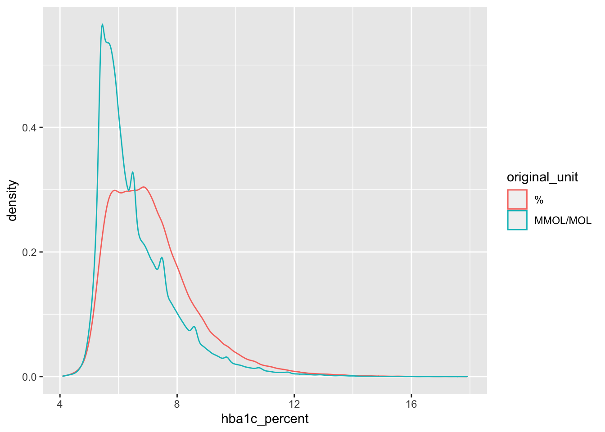

# Curate biomarker trajectory data from primary care data {#traj-pcp}

In this step, we curate biomarker trajectory data extracted from reformatted primary care table prepared in \@ref(prep_pcp_data).


Load necessary packages

```r
library(tidyverse)
library(knitr)
```

Load reformatted primary care table 
<!-- and remove events marked as special dates -->
<!-- # gp_clinical <- gp_clinical[!gp_clinical$special_dt,] -->

```r
gp_clinical <- data.table::fread("generated_data/entire_gp_clinical_30March2021_formatted.txt")
head(gp_clinical)
```

```
##      f.eid data_provider   event_dt value1 value2 value3  code terminology
## 1: 1000050             3 1961-02-16                      S337.       read3
## 2: 1000050             3 1965-05-15                      S4B0.       read3
## 3: 1000050             3 1979-07-27                      9N1K.       read3
## 4: 1000050             3 1985-01-01                      7K6R.       read3
## 5: 1000050             3 1987-01-01                      XE108       read3
## 6: 1000050             3 1987-02-01                      XE0as       read3
##    special_dt
## 1:      FALSE
## 2:      FALSE
## 3:      FALSE
## 4:      FALSE
## 5:      FALSE
## 6:      FALSE
```

Read in the previously generated full code dictionary for primary care terms. 

```r
full_dict <- readRDS("generated_data/full_dict.RDS")
tail(full_dict)
```

```
##         code                                      term_description terminology
## 549496 YX128                   Attending Diabetes satellite clinic       read3
## 549497 YX129                                  Consultant Urologist       read3
## 549498 YX131 Cytoscopy Expected Findings & Plan of Action if Found       read3
## 549499 YX132                    Normal Urethra, Prostate & Bladder       read3
## 549500 YX137                              Stroke/TIA annual review       read3
## 549501 ya299                   FH: Alpha 1 anti-trypsin deficiency       read3
##        terminology_note
## 549496   TPP Local Code
## 549497   TPP Local Code
## 549498   TPP Local Code
## 549499   TPP Local Code
## 549500   TPP Local Code
## 549501   TPP Local Code
```

For the purpose of combining the dictionary with gp_clinical, remove terms with missing descriptions, additional descriptions for the same code, and identical codes+descriptions across terminology(read v2/CTV3)


```r
full_dict <- full_dict %>%
  select(-terminology) %>%
  distinct() %>%
  filter(term_description != "") %>%
  distinct(code, .keep_all = T)

tail(full_dict)
```

```
##         code                                      term_description
## 307923 YX128                   Attending Diabetes satellite clinic
## 307924 YX129                                  Consultant Urologist
## 307925 YX131 Cytoscopy Expected Findings & Plan of Action if Found
## 307926 YX132                    Normal Urethra, Prostate & Bladder
## 307927 YX137                              Stroke/TIA annual review
## 307928 ya299                   FH: Alpha 1 anti-trypsin deficiency
##        terminology_note
## 307923   TPP Local Code
## 307924   TPP Local Code
## 307925   TPP Local Code
## 307926   TPP Local Code
## 307927   TPP Local Code
## 307928   TPP Local Code
```

Add the term descriptions to gp_clinical.

```r
gp_clinical <- gp_clinical %>%
  left_join(full_dict) 
```


Define the clinical terms to extract from gp_clinical for each biomarker. Each biomarker gets a string to be used in a grepl pattern matching query, and as such different patterns should be separated by '|', brackets used to denote multiple possible patterns to match, and '^' to denote the beginning of the string.

```r
BP_codes <- "^246[.cdgABCDEFGJNPQRSTVWXY012345679]|^XaF4[abFLOS]|^XaJ2[EFGH]|^XaKF[xw]|^G20"
HDL_codes <- '^44d[23]|^X772M|^44P[5BC]|^XaEVr'
LDL_codes <- '^44d[45]|^44P[6DE]|^XaEVs' 
totchol_codes <- "^44P[.12349HJKZ]|^XE2eD|^XSK14|^XaFs9|^XaIRd|^XaJe9|^XaLux" 
triglyc_codes <- '^44e|^44Q|^X772O|^XE2q9' 
fastgluc_codes <- "^44[fg]1"
randgluc_codes <- "^44[fg][0\\.]|^44TA|^XM0ly"
a1c_codes <- "^XaPbt|^XaERp|^X772q|^42W[12345Z\\.]\\.|^44TB\\."
height_weight_BMI_codes <- "^XaCDR|^XaJJH|^XaJqk|^XaZcl|^22K|^229|^22A|^162[23]|^X76CG|^XE1h4|^XM01G|^Xa7wI"
blood_creatinine_codes <- '^44J3[.0123z]|^44J[CDF]|XE2q5|XaERc|XaERX|XaETQ|^4Q40.|X771Q'
urine_creatinine_codes <- '^46M7'
urine_albumin_codes <- '^46N4|^XE2eI|^46N8.|^46W[\\.01]|^XE2bw'
UACR_codes <- '^46TC|^XE2n3|^X773Y|^46TD|^XE2n4'
```

## Total cholesterol
UK Biobank measurements range from 0.601 to 15.46 mmol/L.  We filter the allowable range to lie between 0.5 and 30.

```r
totchol <- gp_clinical %>%
  filter(grepl(totchol_codes, code)) %>%
  mutate(totchol = coalesce(as.numeric(value1), as.numeric(value2), as.numeric(value3))) %>%
  filter(totchol > 0.5 & totchol < 30) %>%
  filter(!(value3 %in% c("MEA001", "mg/mmol", "%", "MEA090", "MEA093", 
                         "MEA099", "MEA110", "MEA142",  "MEA156", "mmo", 
                         "mmol", "mmol/d", "mOsm/kg", "mPa/s", "nmol/l", 
                         "U/mL", "umol/L")))

totchol %>% group_by(code, term_description) %>% 
  summarize(n=n(), mean = mean(totchol, na.rm=T)) %>% 
  arrange(desc(n)) %>% kable()
```


|code  |term_description                |      n|     mean|
|:-----|:-------------------------------|------:|--------:|
|XE2eD |Serum cholesterol level         | 910180| 5.191951|
|44P.. |Serum cholesterol               | 295052| 5.161988|
|44PJ. |Serum total cholesterol level   |  63275| 5.076448|
|44PH. |Total cholesterol measurement   |  42449| 5.115970|
|XaJe9 |Serum total cholesterol level   |  40193| 5.278462|
|XaFs9 |Fasting cholesterol level       |   3723| 5.641230|
|XSK14 |Total cholesterol measurement   |   1684| 5.282773|
|XaIRd |Plasma total cholesterol level  |   1476| 5.246321|
|44P3. |Serum cholesterol raised        |   1398| 6.421216|
|44P1. |Serum cholesterol normal        |   1377| 4.706652|
|44PK. |Serum fasting total cholesterol |   1324| 5.220702|
|44PZ. |Serum cholesterol NOS           |    548| 5.445693|
|XaLux |Serum fasting total cholesterol |    335| 5.373194|
|44P2. |Serum cholesterol borderline    |    328| 5.898506|
|44P4. |Serum cholesterol very high     |     53| 7.779245|
|44P9. |Serum cholesterol studies       |     15| 4.638667|

```r
ggplot(data=totchol, aes(x=log10(totchol))) + geom_density() + theme_minimal()
```



## HDL
UK Biobank measurements range from 0.219 to 4.401 mmol/L.  We filter the allowable range to be under 10, but not 0.

```r
HDL <- gp_clinical %>%
  filter(grepl(HDL_codes, code)) %>% 
  mutate(HDL = coalesce(as.numeric(value1), as.numeric(value2), as.numeric(value3))) %>%
  filter(HDL > 0 & HDL < 10) %>%
  filter(!(value3 %in% c("09", "MEA082", "MEA095", "MEA099", "MEA104", "MEA151", 
                         "mmol", "mOsm/kg", "mg/mmol")))

HDL %>% group_by(code, term_description) %>% 
  summarize(n=n(), mean = mean(HDL, na.rm=T)) %>% 
  arrange(desc(n)) %>% kable()
```


|code  |term_description                           |       n|     mean|
|:-----|:------------------------------------------|-------:|--------:|
|44P5. |Serum HDL cholesterol level                | 1042737| 1.472108|
|XaEVr |Plasma HDL cholesterol level               |    8120| 1.406047|
|44PB. |Serum fasting HDL cholesterol level        |    7580| 1.545555|
|44PC. |Serum random HDL cholesterol level         |     731| 1.460260|
|44d3. |Plasma fasting HDL cholesterol level       |     630| 1.326984|
|44d2. |Plasma random HDL cholesterol level        |     344| 1.448663|
|X772M |High density lipoprotein cholesterol level |     130| 1.674154|

```r
ggplot(data=HDL, aes(x=log10(HDL))) + geom_density() + theme_minimal()
```



## LDL
UK Biobank measurements range from 0.226 to 9.797 mmol/L.  We filter the allowable range to be under 30, but not 0.

```r
LDL <- gp_clinical %>%
  filter(grepl(LDL_codes, code)) %>%
  mutate(LDL = coalesce(as.numeric(value1), as.numeric(value2), as.numeric(value3))) %>%
  filter(LDL > 0 & LDL < 30) %>%
  filter(!(value3 %in% c("MEA142", "MEA151")))

LDL %>% group_by(code, term_description) %>% 
  summarize(n=n(), mean = mean(LDL, na.rm=T)) %>% 
  arrange(desc(n)) %>% kable()
```


|code  |term_description                     |      n|     mean|
|:-----|:------------------------------------|------:|--------:|
|44P6. |Serum LDL cholesterol level          | 673558| 3.034787|
|XaEVs |Plasma LDL cholesterol level         |   8212| 3.213037|
|44PD. |Serum fasting LDL cholesterol level  |    501| 3.395888|
|44d5. |Plasma fasting LDL cholesterol level |    274| 3.346460|
|44PE. |Serum random LDL cholesterol level   |    232| 3.155948|
|44d4. |Plasma random LDL cholesterol level  |     36| 3.421944|

```r
ggplot(data=LDL, aes(x=log10(LDL))) + geom_density() + theme_minimal()
```



## Triglycerides
UK Biobank measurements range from 0.231 to 11.278 mmol/L. We filter the allowable range to be under 30, but not 0.

```r
triglycerides <- gp_clinical %>%
  filter(grepl(triglyc_codes, code)) %>%
  mutate(triglyc = coalesce(as.numeric(value1), as.numeric(value2), as.numeric(value3))) %>%
  filter(triglyc > 0 & triglyc < 30) %>%
  filter(!(value3 %in% c("g", "g/l", "MEA099", "MEA156")))

triglycerides %>% group_by(code, term_description) %>% 
  summarize(n=n(), mean= mean(triglyc, na.rm=T)) %>% 
  arrange(desc(n)) %>% kable()
```


|code  |term_description                  |      n|     mean|
|:-----|:---------------------------------|------:|--------:|
|XE2q9 |Serum triglyceride levels         | 712076| 1.618299|
|44Q.. |Serum triglycerides               | 312907| 1.589418|
|44e.. |Plasma triglyceride level         |   8750| 1.726578|
|44Q4. |Serum fasting triglyceride level  |   4812| 1.636868|
|X772O |Triglyceride level                |   4444| 1.817549|
|44QZ. |Serum triglycerides NOS           |    877| 1.544276|
|44Q1. |Serum triglycerides normal        |    282| 1.263794|
|44Q3. |Serum triglycerides raised        |    206| 3.350194|
|44e1. |Plasma fasting triglyceride level |    105| 1.995810|
|44Q2. |Serum triglycerides borderline    |     53| 2.015094|
|44Q5. |Serum random triglyceride level   |     26| 1.783846|

```r
ggplot(data=triglycerides, aes(x=log10(triglyc))) + geom_density() + theme_minimal()
```



## Fasting Glucose
UK Biobank measurements for glucose range from 0.995 to 36.813 mmol/L.  We filter the allowable range of fasting glucose to be under 60, but not 0. 

```r
fastgluc <- gp_clinical %>%
  filter(grepl(fastgluc_codes, code)) %>%
  mutate(fastgluc = coalesce(as.numeric(value1), as.numeric(value2), as.numeric(value3))) %>%
  filter(fastgluc > 0 & fastgluc < 60) %>%
  filter(value3 %in% c("", "MEA000", "MEA061", "MEA096", "MEA194", "Mmol/L", 
                       "Unknown", "mmol/L", "mmol/l", "mU/l", "units"))

fastgluc %>% group_by(code, term_description) %>% 
  summarize(n=n(), mean = mean(fastgluc, na.rm=T)) %>% 
  arrange(desc(n)) %>% kable()
```


|code  |term_description             |      n|     mean|
|:-----|:----------------------------|------:|--------:|
|44g1. |Plasma fasting glucose level | 199962| 5.548240|
|44f1. |Serum fasting glucose level  |  45515| 5.595539|

```r
ggplot(data=fastgluc, aes(x=log10(fastgluc))) + geom_density() + theme_minimal()
```



## Random glucose
UK Biobank measurements for glucose range from 0.995 to 36.813 mmol/L.  We filter the allowable range of fasting glucose to be under 60, but not 0.

```r
randgluc <- gp_clinical %>%
  filter(grepl(randgluc_codes, code)) %>% 
  mutate(randgluc = coalesce(as.numeric(value1), as.numeric(value2), as.numeric(value3))) %>%
  filter(randgluc > 0 & randgluc < 60) %>%
  filter(value3 %in% c("", "MEA000", "MEA061", "MEA096", "MEA194", "Mmol/L", 
                       "Unknown", "mmol/L", "mmol/l", "mU/l", "units"))

randgluc %>% group_by(code, term_description) %>% 
  summarize(n=n(), mean = mean(randgluc, na.rm=T)) %>% 
  arrange(desc(n)) %>% kable()
```


|code  |term_description            |      n|     mean|
|:-----|:---------------------------|------:|--------:|
|XM0ly |Plasma glucose level        | 309834| 5.729634|
|44g.. |Plasma glucose level        |  81044| 5.906326|
|44f.. |Serum glucose level         |  58942| 5.639431|
|44g0. |Plasma random glucose level |  10730| 6.190034|
|44f0. |Serum random glucose level  |   5099| 6.066390|
|44TA. |Plasma glucose              |   1423| 5.997484|

```r
ggplot(data = randgluc, aes(x=log10(randgluc))) + geom_density() + theme_minimal()
```



## Urine Albumin
UK Biobank measurements for microalbumin in urine have a maximum value of 6746.5 mg/L, with many values below the measurement instrument's lower limit of detection of 6.7 mg/L. We filter the allowable range to be under 7,000, but not 0.

```r
#Extract urine albumin
ualb <- gp_clinical %>%
  filter(grepl(urine_albumin_codes, code, ignore.case=T)) %>%
  mutate(micro=grepl("micro", term_description, ignore.case=T)) %>%
  mutate(value = coalesce(as.numeric(value1), as.numeric(value2), as.numeric(value3))) %>%
  filter(!is.na(value)  & value != 0) %>% #& value < 500
  filter(!(value3 %in% c("0.3", "MEA001", "mg/mmol", "ml/min", "mmol/L", "MEA086",
                         "MEA096", "MEA120", "MEA142", "MEA166", "g/L", "MEA057"))) %>%  
  filter(value < 7000) %>%
  select(-value1, -value2) %>% 
  dplyr::rename(code_ualb = code, term_description_ualb = term_description,
                             ualb_mg_L = value) %>%
  distinct()

ualb %>% group_by(code_ualb, term_description_ualb) %>%
  summarize(n=n(), mean = mean(ualb_mg_L)) %>%
  arrange(desc(n)) %>% kable()
```


|code_ualb |term_description_ualb       |     n|     mean|
|:---------|:---------------------------|-----:|--------:|
|XE2eI     |Urine albumin level         | 72399| 32.51820|
|XE2bw     |Urine microalbumin level    | 52581| 33.06640|
|46N4.     |Urine albumin               | 28119| 33.41504|
|46W..     |Urine microalbumin          | 11801| 29.60518|
|46W1.     |Urine microalbumin negative |   304| 11.47477|
|46W0.     |Urine microalbumin positive |   105| 64.95429|
|46N8.     |Urine microalbumin profile  |    25|  6.35600|

Based on the distributions, albumin values are given in mg/L, regardless of whether the term description says microalbumin or albumin. 

```r
ggplot(data=ualb, aes(x=log10(ualb_mg_L), color = term_description_ualb)) + geom_density()
```


## Urine creatinine
UK Biobank measurements range from 88 to 88,160 micromoles/L. We filter the allowable range to be below 88,000, but not 0.

```r
ucreat <- gp_clinical %>%
  filter(grepl(urine_creatinine_codes, code, ignore.case=T)) %>%
  mutate(value = coalesce(as.numeric(value1), as.numeric(value2), as.numeric(value3))) %>%
  filter(!is.na(value)  & value != 0) %>% 
  mutate(ucreat_umol_L = value * 1000) %>%
  filter(value3 != "MEA099" & value3 != "umol/l") %>%
  filter(ucreat_umol_L < 88000) %>%
  select(-value, -value1, -value2, -value3) %>%
  dplyr::rename(code_ucreat = code, term_description_ucreat = term_description) %>%
  distinct()

ucreat %>% group_by(code_ucreat, term_description_ucreat) %>%
  summarize(n=n(), mean = mean(ucreat_umol_L)) %>% kable()
```


|code_ucreat |term_description_ucreat |     n|     mean|
|:-----------|:-----------------------|-----:|--------:|
|46M7.       |Urine creatinine        | 41123| 8799.117|

```r
ggplot(data=ucreat, aes(x=log10(log10(ucreat_umol_L)))) + geom_density() + theme_minimal()
```



## Urine ACR (Albumin:Creatinine Ratio)
This ratio will be needed to define micro/macroalbuminuria phenotypes. The calculated UACR values in UK Biobank lie between 0.15 and 2141.17.  For UACR calculated from primary care albumin and creatinine, we only filter based on the original albumin and creatinine measurements. For primary care records of UACR, we filter the value to be below 1000, but not 0.

```r
#Manually generate the UACRs from urine creatinine and albumin.
ratio_manual <- ualb %>%
  inner_join(ucreat) %>%
  mutate(UACR = ualb_mg_L/ucreat_umol_L *1000, manual=T)

#Extract UACR from primary care that is already calculated
ratio <- gp_clinical %>%
  filter(grepl(UACR_codes, code, ignore.case=T)) %>%
  mutate(UACR = coalesce(as.numeric(value1), as.numeric(value2), as.numeric(value3)),
         micro = grepl("micro", term_description),
         manual = F) %>%
  filter(!is.na(UACR)  & UACR != 0 & UACR < 1000) %>%
  filter(!(value3 %in% c("%", "MEA001", "MEA083", "MEA096",
                         "MEA156", "MEA169", "MEA241",
                         "ml/min", "mg/L", "m1/min", "mmol/L", 
                         "ng/mL","umol/L", "mg/l"))) %>%
  select(-value1, -value2, -value3) %>%
  distinct() %>%
  dplyr::rename(code_uacr = code, term_description_uacr = term_description)

#Combine the manually-calculated and already-calculated values of UACR
UACR <- full_join(ratio, ratio_manual) %>%
  distinct(f.eid, event_dt, .keep_all = T)

UACR %>% group_by(manual, term_description_uacr, term_description_ualb) %>%
  summarize(n=n(), mean = mean(UACR, na.rm=T)) %>%
  arrange(desc(n)) %>% kable()
```


|manual |term_description_uacr               |term_description_ualb |      n|     mean|
|:------|:-----------------------------------|:---------------------|------:|--------:|
|FALSE  |Urine albumin/creatinine ratio      |NA                    | 116580| 4.828529|
|FALSE  |Urine albumin:creatinine ratio      |NA                    |  33142| 5.069166|
|TRUE   |NA                                  |Urine albumin         |   7069| 3.213930|
|TRUE   |NA                                  |Urine microalbumin    |   3241| 4.998741|
|FALSE  |Urine microalbumin:creatinine ratio |NA                    |    700| 9.826057|

```r
ggplot(data=UACR, aes(x=log10(UACR))) + geom_density() + theme_minimal()
```




## Blood/Serum creatinine
This is needed to calculate eGFR. UK Biobank measures lie between 10.7 and 1499.3. We filter the allowable range to lie between 10 and 1500.

```r
blood_creatinine <- gp_clinical %>%
  filter(grepl(blood_creatinine_codes, code)) %>% 
  mutate(blood_creatinine = coalesce(as.numeric(value1), as.numeric(value2))) %>%
  filter(blood_creatinine > 10 & blood_creatinine < 1500) %>%
  filter(!(value3 %in% 
             c("m1/min", "MEA082", "MEA083", "MEA095", "MEA096", "mg/mmol", 
               "ml/min", "mmol", "mmol/l", "mmol/L", "nmol/l", "pmol/l", 
               "uL/cu mm", "um", "umo", "umol"))) %>% 
  mutate(creatinine_type = ifelse(grepl("serum", term_description, ignore.case=T), "Serum", 
                               ifelse(grepl("plasma", term_description, ignore.case=T), "Plasma",
                                      "Unspecified"))) 

blood_creatinine %>% group_by(code, term_description) %>% 
  summarize(n=n(), mean=mean(blood_creatinine)) %>% 
  arrange(desc(n)) %>% kable()
```


|code  |term_description                  |       n|      mean|
|:-----|:---------------------------------|-------:|---------:|
|XE2q5 |Serum creatinine level            | 1140846|  84.55727|
|44J3. |Serum creatinine                  |  513980|  82.49880|
|XaETQ |Plasma creatinine level           |    8762|  86.00913|
|44J3z |Serum creatinine NOS              |    4395|  83.70808|
|44J32 |Serum creatinine normal           |    2776|  84.43058|
|X771Q |Creatinine level                  |     418| 104.56531|
|44J33 |Serum creatinine raised           |     380| 123.55263|
|44J31 |Serum creatinine low              |     156|  63.65641|
|44JF. |Plasma creatinine level           |     138|  82.04348|
|4Q40. |Creatinine level                  |      57|  79.56140|
|44JD. |Corrected serum creatinine level  |      30|  78.10000|
|44J30 |Serum creatinine abnormal         |       9|  97.77778|
|XaERc |Corrected serum creatinine level  |       5| 102.60000|
|XaERX |Corrected plasma creatinine level |       4| 107.50000|

```r
ggplot(data=blood_creatinine, aes(x=blood_creatinine, color=creatinine_type)) +
  geom_density() + theme_minimal()
```



## HbA1c
Calculate HbA1c in both % (US) and mmol/mol (UK). UK Biobank measurements lie between 15 and 515.2 mmol/mol.  In primary care data, some values are given in percent, some in mmol/mol. We filter the allowable range to lie between 4 and 18 (%) or between 20.2 and 173.2 (mmol/mol) to guard against including values recorded under the incorrect unit. Conversion between % and mmol/mol is performed using the IFCC-NGSP master equation (https://doi.org/10.1373/clinchem.2008.103556).


```r
a1c <- gp_clinical %>%
  filter(grepl(a1c_codes, code)) %>%
  mutate(hba1c = coalesce(as.numeric(value1), as.numeric(value2), as.numeric(value3))) %>%
  filter(hba1c > 0) %>%
  mutate(value3 = toupper(value3)) %>%
  mutate(value3 = ifelse(value3 %in%  c("MEA000", "MMOL/M", "MEA097", "UNKNOWN", "MEA001", 
                                        "%", "HBA1C", "%TOTAL HB", "% TOTAL HB", "MEA215", 
                                        "MMOL/MOL HB", "PER CENT", "%TOTAL"), "", value3)) %>%
  mutate(units = ifelse(value3 != "", value3, 
                        ifelse(code %in% c("XaPbt", "42W5."), "MMOL/MOL", "%"))) %>%
  filter(units %in% c("%", "MMOL/MOL")) %>%
  mutate(hba1c_percent = ifelse(units == "%", round(hba1c, 1), 
                                round(hba1c/10.929 + 2.15, 1))) %>%
  mutate(hba1c_mmol_mol = ifelse(units =="%", round(10.929 * (hba1c - 2.15), 1), 
                                 round(hba1c, 1))) %>%
  filter(hba1c_percent > 4 & hba1c_percent < 18) %>%
  dplyr::rename(original_unit = units)

a1c %>% group_by(code, term_description) %>%
  summarize(n=n(), mean=mean(hba1c_percent, na.rm=T)) %>%
  arrange(desc(n)) %>% kable()
```


|code  |term_description                                                                                            |      n|      mean|
|:-----|:-----------------------------------------------------------------------------------------------------------|------:|---------:|
|XaPbt |Haemoglobin A1c level - International Federation of Clinical Chemistry and Laboratory Medicine standardised | 252770|  6.563749|
|XaERp |HbA1c level (DCCT aligned)                                                                                  | 129570|  7.100803|
|42W5. |Haemoglobin A1c level - International Federation of Clinical Chemistry and Laboratory Medicine standardised |  98480|  6.690495|
|X772q |Haemoglobin A1c level                                                                                       |  42743|  7.198669|
|42W4. |HbA1c level (DCCT aligned)                                                                                  |  23729|  7.056766|
|42W.. |Hb. A1C - diabetic control                                                                                  |  15924|  7.524944|
|44TB. |Haemoglobin A1c level                                                                                       |  10418|  7.421703|
|42W2. |Hb. A1C 7-10% - borderline                                                                                  |    203|  8.169458|
|42W1. |Hb. A1C < 7% - good control                                                                                 |    195|  6.182051|
|42WZ. |Hb. A1C - diabetic control NOS                                                                              |     34|  6.767647|
|42W3. |Hb. A1C > 10% - bad control                                                                                 |     29| 11.082759|

```r
ggplot(data=a1c, aes(x = hba1c_percent, color = original_unit)) + geom_density()
```



## BMI
Height may be measured using meters or centimeters. Height was filtered to lie between 1.25m (4ft 1.2 inches) and 2.1m (6ft 10.7 inches). Values between 125 and 210 were assumed to be in cm and so were divided by 100.
Weight is measured in kg and was filtered to lie between 30kg(66.1 lb) and 200kg(440.9 lb).
BMI was filtered to lie between 12 and 75 kg/m^2. 

```r
#Extract height, weight, and BMI
hwbmi <- gp_clinical %>%
  filter(grepl(height_weight_BMI_codes, code)) %>%
  mutate(value = coalesce(as.numeric(value1), as.numeric(value2), as.numeric(value3))) %>%
  filter(!is.na(value) & value > 0) %>%
  mutate(trait = ifelse(grepl("BMI|Body Mass Index", term_description, ignore.case=T), "BMI",
                        ifelse(grepl("Height", term_description, ignore.case=T), "Height",
                               "Weight"))) %>%
  mutate(value = ifelse(trait == "Height" & value > 2.1, value/100, value)) %>% #cm to meters
  filter((trait == "Weight" & value < 200 & value > 30) |
         (trait == "Height" & value < 2.1 & value > 1.25 )|
         (trait == "BMI" & value < 75 & value > 12)) %>% 
  arrange(f.eid, event_dt)

#Here are the resulting terms:
hwbmi %>% group_by(code, term_description, trait) %>% 
  summarize(n = n(), mean=round(mean(value), 1)) %>% 
  arrange(trait, desc(n)) %>% kable()
```


|code  |term_description                         |trait  |       n|  mean|
|:-----|:----------------------------------------|:------|-------:|-----:|
|22K.. |Body Mass Index                          |BMI    | 1430129|  28.3|
|22K2. |Body Mass Index high K/M2                |BMI    |     654|  31.0|
|22K1. |Body Mass Index normal K/M2              |BMI    |     356|  22.9|
|22K4. |Body mass index index 25-29 - overweight |BMI    |     317|  27.4|
|22K5. |Body mass index 30+ - obesity            |BMI    |     203|  34.3|
|XaJqk |Body mass index 20-24 - normal           |BMI    |     139|  23.1|
|22K3. |Body Mass Index low K/M2                 |BMI    |      28|  18.4|
|22K8. |Body mass index 20-24 - normal           |BMI    |      17|  23.1|
|XaCDR |Body mass index less than 20             |BMI    |      13|  18.5|
|XaZcl |Baseline body mass index                 |BMI    |       4|  33.0|
|22K6. |Body mass index less than 20             |BMI    |       3|  19.0|
|22K7. |Body mass index 40+ - severely obese     |BMI    |       3|  41.9|
|XaJJH |Body mass index 40+ - severely obese     |BMI    |       3|  42.8|
|229.. |O/E - height                             |Height |  946337|   1.7|
|229Z. |O/E - height NOS                         |Height |      64|   1.7|
|2293. |O/E -height within 10% average           |Height |      11|   1.7|
|2292. |O/E - height 10-20% < average            |Height |       2|   1.6|
|2291. |O/E-height > 20% below average           |Height |       1|   1.8|
|2294. |O/E-height 10-20% over average           |Height |       1|   1.8|
|2296. |O/E - loss of height                     |Height |       1|   1.6|
|22A.. |O/E - weight                             |Weight | 1575549|  80.4|
|1622. |Weight increasing                        |Weight |     251|  80.8|
|22A3. |O/E - weight within 10% ideal            |Weight |     122|  66.4|
|XM01G |Weight observation                       |Weight |     110|  72.8|
|22A4. |O/E - weight 10-20% over ideal           |Weight |     103|  81.5|
|22AZ. |O/E - weight NOS                         |Weight |     100|  71.7|
|XE1h4 |O/E - weight greater than 20% over ideal |Weight |      64| 100.3|
|22A5. |O/E - weight > 20% over ideal            |Weight |      48|  97.7|
|22A7. |Baseline weight                          |Weight |       6|  99.4|
|22A6. |O/E - Underweight                        |Weight |       5|  52.2|
|22A8. |Weight loss from baseline weight         |Weight |       2|  54.0|
|22A2. |O/E -weight 10-20% below ideal           |Weight |       1|  67.0|
|22AA. |Overweight                               |Weight |       1|  86.0|
|X76CG |Usual body weight                        |Weight |       1| 117.0|
|Xa7wI |Observation of measures of body weight   |Weight |       1|  91.0|

```r
#Separate the traits
weight <- hwbmi %>% filter(trait == "Weight") 
height <- hwbmi %>% filter(trait == "Height") 
BMI <- hwbmi %>% filter(trait == "BMI") 

#Some records from data provider 2 give weight and BMI
bmi_extra <- weight %>% 
  filter(data_provider == 2) %>% 
  mutate(bmi_extra = as.numeric(value3)) %>% 
  filter(!is.na(bmi_extra)) %>%
  filter(bmi_extra > 12)
head(bmi_extra)
```

```
##      f.eid data_provider   event_dt value1 value2 value3  code terminology
## 1: 1000372             2 2016-02-02 63.500          23.0 22A..       read2
## 2: 1000425             2 2004-02-26 108.50          39.8 22A..       read2
## 3: 1000425             2 2004-06-04 116.10          42.6 22A..       read2
## 4: 1000425             2 2005-01-11 110.00          40.4 22A..       read2
## 5: 1000425             2 2005-08-12 110.00          40.4 22A..       read2
## 6: 1000425             2 2006-10-25 112.00          41.1 22A..       read2
##    special_dt term_description terminology_note value  trait bmi_extra
## 1:      FALSE     O/E - weight             <NA>  63.5 Weight      23.0
## 2:      FALSE     O/E - weight             <NA> 108.5 Weight      39.8
## 3:      FALSE     O/E - weight             <NA> 116.1 Weight      42.6
## 4:      FALSE     O/E - weight             <NA> 110.0 Weight      40.4
## 5:      FALSE     O/E - weight             <NA> 110.0 Weight      40.4
## 6:      FALSE     O/E - weight             <NA> 112.0 Weight      41.1
```

```r
#combine the traits in wider format
weight_pre <- weight %>% select(-c(terminology, value1, value2, value3, trait)) %>%
  dplyr::rename(weight = value, weight_code = code, weight_term_description = term_description)
height_pre <- height %>% select(-c(terminology, value1, value2, value3, trait))  %>%
  dplyr::rename(height = value, height_code = code, height_term_description = term_description)
BMI_pre <- BMI %>% select(-c(terminology, value1, value2, value3, trait))  %>%
  dplyr::rename(BMI = value, BMI_code = code, BMI_term_description = term_description)
bmi_extra_pre <- bmi_extra %>% select(-c(terminology, term_description, value1, value2, value3, trait, value)) %>%
  dplyr::rename(bmi_extra_code = code)

joined_bmi <- full_join(weight_pre, height_pre) %>%
              full_join(BMI_pre) %>%
              full_join(bmi_extra_pre)
head(joined_bmi)
```

```
##      f.eid data_provider   event_dt weight_code special_dt
## 1: 1000050             3 2001-01-24       22A..      FALSE
## 2: 1000050             3 2014-11-25       22A..      FALSE
## 3: 1000068             3 1994-11-30       22A..      FALSE
## 4: 1000068             3 1999-01-07       22A..      FALSE
## 5: 1000068             3 2001-07-20       22A..      FALSE
## 6: 1000068             3 2006-01-18       22A..      FALSE
##    weight_term_description terminology_note weight height_code
## 1:            O/E - weight             <NA>  54.00       229..
## 2:            O/E - weight             <NA>  62.00       229..
## 3:            O/E - weight             <NA>  70.50       229..
## 4:            O/E - weight             <NA>  70.40       229..
## 5:            O/E - weight             <NA>  73.64       229..
## 6:            O/E - weight             <NA>  80.50       229..
##    height_term_description height BMI_code BMI_term_description    BMI
## 1:            O/E - height  1.630    22K..      Body Mass Index 20.300
## 2:            O/E - height  1.630    22K..      Body Mass Index 23.335
## 3:            O/E - height  1.690     <NA>                 <NA>     NA
## 4:            O/E - height  1.690     <NA>                 <NA>     NA
## 5:            O/E - height  1.676    22K..      Body Mass Index 26.200
## 6:            O/E - height  1.680    22K..      Body Mass Index 28.500
##    bmi_extra_code bmi_extra
## 1:           <NA>        NA
## 2:           <NA>        NA
## 3:           <NA>        NA
## 4:           <NA>        NA
## 5:           <NA>        NA
## 6:           <NA>        NA
```


Clean the combined data, filling in missing height values from previous/subsequent measurements or BMI. Filter out cases where the calculated and reported BMI differ by more than 1.5.

```r
cleaned_bmi <- joined_bmi %>%
  group_by(f.eid) %>%
  fill(height, .direction = "downup") %>%
  mutate(BMI_coalesce = round(coalesce(BMI, bmi_extra), 1),
         BMI_calculated = round(weight/(height^2), 1),
         BMI_mismatch = BMI_coalesce != BMI_calculated, 
         BMI_diff = BMI_coalesce - BMI_calculated) %>%
  filter(!(!is.na(BMI_diff) & abs(BMI_diff) > 1.5)) %>%
  mutate(BMI_final = coalesce(BMI_calculated, BMI_coalesce)) %>%
  mutate(height = ifelse(!is.na(height), height, sqrt(weight/BMI))) %>%
  dplyr::rename(BMI_reported = BMI_coalesce, height_carried = height) %>%
  filter(height_carried < 2.1 & height_carried > 1.25 & 
           BMI_final < 75 & BMI_final > 12) %>%
  select(f.eid, data_provider, event_dt, weight, height_carried, 
         BMI_reported, BMI_calculated, BMI = BMI_final) %>% 
  distinct() %>%
  mutate(source="PC")

ggplot(data=cleaned_bmi, aes(x=log10(BMI))) + geom_density() + theme_minimal()
```


## Blood Pressure
To to extract blood pressure, it is necessary to consider both the cases where both Systolic and Diastolic BP are provided in the same record, as well as cases where Systolic and Diastolic BP are given in separate records. 

```r
bp <- gp_clinical %>%
  filter(grepl(BP_codes, code)) %>%
  filter(value1 != "" | value2 != "" | value3 != "")  %>%
  mutate(value1 = as.numeric(value1), value2 = as.numeric(value2), value3 = as.numeric(value3)) 

#Remove some small values in value3 of unknown meaning
bp$value3[bp$value3 < 10] <- NA

#Separate the data into two types of record: One where 2 values are given in 1 record (e.g. Systolic and Diastolic) and another where there is only one value (i.e Systolic only or Diastolic only) given per record. 
```

Multiple values per record: Take the larger value to be systolic and the smaller value to be diastolic. Filter out any records where either of these values are 0.

```r
bp_mult <- bp %>% 
  rowwise() %>%
  filter(sum(!is.na(value1), !is.na(value2), !is.na(value3)) == 2) %>%
  ungroup() %>%
  mutate(Systolic_bp_pc = pmax(value1, value2, value3, na.rm=T)) %>%
  mutate(Diastolic_bp_pc = pmin(value1, value2, value3, na.rm=T)) %>%
  filter(Systolic_bp_pc != 0 & Diastolic_bp_pc != 0)
```


One value per record: filter out those with a value of 0. 

```r
bp_single <- bp %>% 
  rowwise() %>%
  filter(sum(!is.na(value1), !is.na(value2), !is.na(value3)) == 1) %>%
  ungroup() %>%
  mutate(value = coalesce(value1, value2, value3)) %>%
  filter(value != 0) %>%
  arrange(f.eid, event_dt) %>%
  mutate(bp_type =  ifelse(grepl("systolic", term_description, ignore.case=T), "Systolic_bp_pc",
               ifelse(grepl("diastolic", term_description, ignore.case = T), "Diastolic_bp_pc", "Unknown"))) %>%
  select(-value1, -value2, -value3) %>%
  distinct()

#Here are the results for single type:
bp_single %>% 
  group_by(code, term_description, bp_type) %>% 
  summarize(n=n(), mean=round(mean(value, 1))) %>% 
  arrange(bp_type, desc(n)) 
```

```
## # A tibble: 33 × 5
## # Groups:   code, term_description [33]
##    code  term_description                              bp_type           n  mean
##    <chr> <chr>                                         <chr>         <int> <dbl>
##  1 246A. O/E - Diastolic BP reading                    Diastolic_b… 3.13e6    80
##  2 XaJ2F Sitting diastolic blood pressure              Diastolic_b… 3.78e3    80
##  3 XaKFw Average home diastolic blood pressure         Diastolic_b… 3.54e3    79
##  4 XaF4b Average 24 hour diastolic blood pressure      Diastolic_b… 1.72e3    79
##  5 XaF4a Average day interval diastolic blood pressure Diastolic_b… 8.73e2    83
##  6 246R. Sitting diastolic blood pressure              Diastolic_b… 5.49e2    82
##  7 XaJ2H Lying diastolic blood pressure                Diastolic_b… 4.88e2    80
##  8 246c. Average home diastolic blood pressure         Diastolic_b… 1.08e2    82
##  9 XaF4S Average diastolic blood pressure              Diastolic_b… 8.5 e1    81
## 10 246V. Average 24 hour diastolic blood pressure      Diastolic_b… 1.1 e1    91
## # … with 23 more rows
```

Look at the remaining codes to see if they are systolic or diastolic.  For many of these, the same code is given twice, each with a different value. Sometimes an record is a duplicate of a systolic or diastolic measurement. If there are two *unique* values given per ID/date, then we can assume they are systolic (higher) and diastolic (lower). Otherwise, discard that set of values. 

```r
#Unknowns - not specified as Diastolic vs. Systolic
unknowns <- bp_single %>%
  group_by(f.eid, event_dt) %>%
  filter(sum(bp_type == "Unknown") > 0) %>%
  mutate(n = length(unique(value))) %>%
  filter(n == 2) %>%
  mutate(Systolic_bp_pc = max(value)) %>%
  mutate(Diastolic_bp_pc = min(value)) %>%
  distinct(f.eid, event_dt, value, .keep_all = T) %>%
  group_by(f.eid, event_dt) %>%
  mutate(code_systolic = code[which(value == max(value))], 
         code_diastolic = code[which(value == min(value))], 
         term_description_systolic = term_description[which(value == max(value))], 
         term_description_diastolic = term_description[which(value == min(value))])

#Prepare for merging
bp_single_less <- bp_single %>% 
  distinct(f.eid, data_provider, event_dt, value, bp_type, .keep_all = T) %>%
  group_by(f.eid, event_dt) %>%
  filter(sum(bp_type == "Systolic_bp_pc") == 1 & 
           sum(bp_type == "Diastolic_bp_pc") == 1) %>%
  filter(bp_type != "Unknown")

systolic <- bp_single_less %>%
  filter(bp_type == "Systolic_bp_pc") %>%
  dplyr::rename(code_systolic = code, 
                Systolic_bp_pc = value, 
                term_description_systolic = term_description) %>%
  select(-bp_type)

diastolic <- bp_single_less %>%
  filter(bp_type == "Diastolic_bp_pc") %>%
  dplyr::rename(code_diastolic = code, 
                Diastolic_bp_pc = value, 
                term_description_diastolic = term_description) %>%
  select(-bp_type)
        
bp_single_wide <- full_join(systolic, diastolic)
head(bp_single_wide)
```

```
## # A tibble: 6 × 12
## # Groups:   f.eid, event_dt [6]
##     f.eid data_provider event_dt   code_systolic terminology special_dt
##     <int>         <int> <date>     <chr>         <chr>       <lgl>     
## 1 1000050             3 2007-04-25 2469.         read3       FALSE     
## 2 1000050             3 2014-11-25 2469.         read3       FALSE     
## 3 1000068             3 1994-11-30 2469.         read3       FALSE     
## 4 1000068             3 1999-01-07 2469.         read3       FALSE     
## 5 1000068             3 2001-07-20 2469.         read3       FALSE     
## 6 1000068             3 2001-11-21 2469.         read3       FALSE     
## # … with 6 more variables: term_description_systolic <chr>,
## #   terminology_note <chr>, Systolic_bp_pc <dbl>, code_diastolic <chr>,
## #   term_description_diastolic <chr>, Diastolic_bp_pc <dbl>
```

Combine each of the cleaned subsets and implement some common sense filters (45 < Systolic bp < 300, 30 < Diastolic bp < Systolic bp) 

```r
unknowns_less <- unknowns %>% 
  select(-term_description, -value, -bp_type, -code, -n) %>%
  distinct()

bp_mult_less <- bp_mult %>% 
  dplyr::rename(term_description_both = term_description) %>%
  dplyr::rename(code_both = code) %>%
  select(f.eid, event_dt, data_provider, terminology, Systolic_bp_pc, Diastolic_bp_pc, code_both, term_description_both) %>%
  distinct()

full_bp_clean <- full_join(unknowns_less, bp_single_wide) %>%
  full_join(bp_mult_less) %>%
  filter(Systolic_bp_pc > Diastolic_bp_pc) %>%
  filter(Systolic_bp_pc >= 45 & Systolic_bp_pc <= 300) %>%
  filter(Diastolic_bp_pc >= 30) %>%
  distinct(f.eid, event_dt, Systolic_bp_pc, Diastolic_bp_pc, .keep_all=T)
```

```
## Joining, by = c("f.eid", "data_provider", "event_dt", "terminology", "special_dt", "terminology_note", "Systolic_bp_pc", "Diastolic_bp_pc", "code_systolic", "code_diastolic", "term_description_systolic", "term_description_diastolic")
## Joining, by = c("f.eid", "data_provider", "event_dt", "terminology", "Systolic_bp_pc", "Diastolic_bp_pc")
```

```r
head(full_bp_clean)
```

```
## # A tibble: 6 × 14
## # Groups:   f.eid, event_dt [6]
##     f.eid data_provider event_dt   terminology special_dt terminology_note
##     <int>         <int> <date>     <chr>       <lgl>      <chr>           
## 1 1000578             2 2002-08-07 read2       FALSE      <NA>            
## 2 1000578             2 2003-02-10 read2       FALSE      <NA>            
## 3 1000602             3 2007-09-28 read3       FALSE      <NA>            
## 4 1017110             2 2003-02-26 read2       FALSE      <NA>            
## 5 1017110             2 2003-06-04 read2       FALSE      <NA>            
## 6 1017110             2 2004-03-24 read2       FALSE      <NA>            
## # … with 8 more variables: Systolic_bp_pc <dbl>, Diastolic_bp_pc <dbl>,
## #   code_systolic <chr>, code_diastolic <chr>, term_description_systolic <chr>,
## #   term_description_diastolic <chr>, code_both <chr>,
## #   term_description_both <chr>
```

```r
ggplot(data=full_bp_clean, aes(x=log10(Systolic_bp_pc))) + geom_density() + theme_minimal()
```


```r
ggplot(data=full_bp_clean, aes(x=log10(Diastolic_bp_pc))) + geom_density() + theme_minimal()
```


## Reformat and trim trajectory table for each biomarker


```r
sbp <- full_bp_clean %>% 
  select(f.eid,Systolic_bp_pc,event_dt) %>% 
  rename(measurement = Systolic_bp_pc) %>% 
  mutate(biomarker = "sbp")

dbp <- full_bp_clean %>% 
  select(f.eid,Diastolic_bp_pc,event_dt) %>% 
  rename(measurement = Diastolic_bp_pc) %>% 
  mutate(biomarker = "dbp")

cholesterol <- totchol %>% 
  select(f.eid,totchol,event_dt) %>% 
  rename(measurement = totchol) %>% 
  mutate(biomarker = "chol")

hdl <- HDL %>% 
  select(f.eid,HDL,event_dt) %>% 
  rename(measurement = HDL) %>% 
  mutate(biomarker = "hdl")

ldl <- LDL %>% 
  select(f.eid,LDL,event_dt) %>% 
  rename(measurement = LDL) %>% 
  mutate(biomarker = "ldl")

trigly <- triglycerides %>% 
  select(f.eid,triglyc,event_dt) %>% 
  rename(measurement = triglyc) %>% 
  mutate(biomarker = "trig")

glu_fast <- fastgluc %>%
  select(f.eid,fastgluc,event_dt) %>% 
  rename(measurement = fastgluc) %>%
  mutate(biomarker = "glucose_fast")

glu_rand <- randgluc %>%
  select(f.eid,randgluc,event_dt) %>% 
  rename(measurement = randgluc) %>% 
  mutate(biomarker = "glucose_rand")

hba1c <- a1c %>% 
  select(f.eid,hba1c_mmol_mol,event_dt) %>% 
  rename(measurement = hba1c_mmol_mol) %>%
  mutate(biomarker = "hba1c")

bmi <- cleaned_bmi %>%
  select(f.eid,BMI,event_dt) %>%
  rename(measurement = BMI) %>%
  mutate(biomarker = "bmi")

blood_creat <- blood_creatinine %>%
  select(f.eid,blood_creatinine,event_dt) %>%
  rename(measurement = blood_creatinine) %>%
  mutate(biomarker = "creat_blood")

uacr <- UACR %>%
  select(f.eid,UACR,event_dt) %>%
  rename(measurement = UACR) %>%
  mutate(biomarker = "uacr")
```

Combine all of biomarker trajectory datasets into a long format. 

```r
biomarker_traj_tab_long <- bind_rows(list(sbp,dbp,cholesterol,hdl,ldl,trigly,
                                          glu_fast,glu_rand,hba1c,bmi,blood_creat,uacr))
```

Create macro/microalbuminuria event table

```r
albuminuria_event_tab <- 
  biomarker_traj_tab_long %>% 
  filter(biomarker == "uacr") %>%
    mutate(macroalbuminuria = ifelse(measurement < 33.9,F,T),
           microalbuminuria = ifelse(measurement < 3.4,F,T)) %>%
    select(f.eid,event_dt,macroalbuminuria,microalbuminuria) %>%
    pivot_longer(cols=c(macroalbuminuria,microalbuminuria),values_to = "event", names_to = "type") %>%
  select(f.eid,event,event_dt,type)
```

Filter out from biomarker trajectory table and albuminuria event table:

- any unknown date of event
- any unknown measurements (only applies to biomarker trajectory table)


```r
biomarker_traj_tab_long <- biomarker_traj_tab_long[!is.na(biomarker_traj_tab_long$event_dt),]
biomarker_traj_tab_long <- biomarker_traj_tab_long[!is.na(biomarker_traj_tab_long$measurement),]

albuminuria_event_tab <- albuminuria_event_tab[!is.na(albuminuria_event_tab$event_dt),]
```

Save the biomarker trajectory data and albuminuria event table extracted from the primary care data

```r
saveRDS(biomarker_traj_tab_long,"generated_data/biomarker_trajectory_pcp.RDS")
saveRDS(albuminuria_event_tab,"generated_data/albuminuria_event_tab_pcp.RDS")
```


